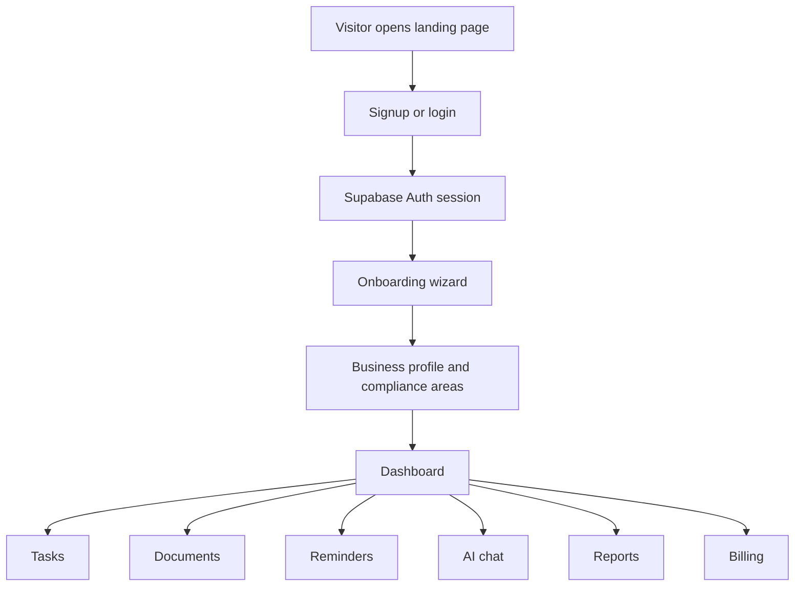
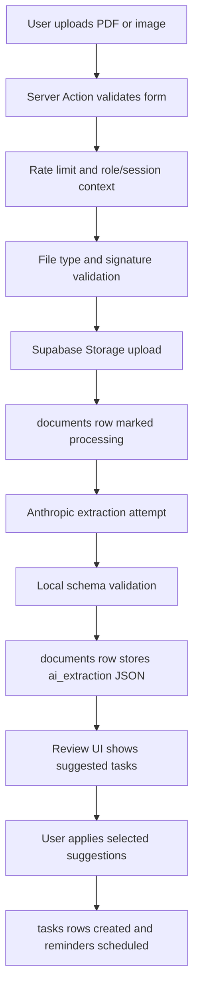
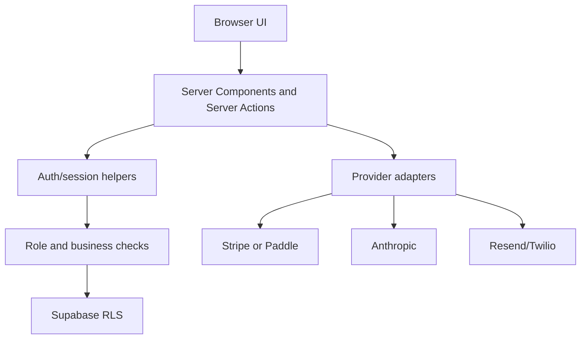

# ComplianceForge MVP Project Learning Case Study

This is a teaching guide, not just a file map.

It uses the ComplianceForge MVP as a real SaaS case study. The goal is to help a learner understand how the app is built, why each layer exists, how the modules work together, how trust boundaries are enforced, and how to study or extend the project without getting lost.

## Learning Objectives

After studying this material, you should be able to:

- explain how a Next.js App Router SaaS is split into marketing, auth, protected app, and API routes
- trace a user from signup to onboarding to dashboard access
- explain why Supabase Auth, Postgres, Storage, and RLS are all part of the same trust model
- describe the difference between tenant data, user data, provider state, runtime secrets, and documentation
- trace a document upload from browser form to Supabase Storage to AI extraction to reviewable task suggestions
- explain why AI-suggested tasks require user confirmation before becoming real compliance work
- describe how reminders are scheduled, deduplicated, rate-limited, and dispatched
- explain the billing adapter pattern that lets the MVP switch between Stripe, Paddle, and manual billing
- identify which code runs in the browser, which code runs on the server, and which code must never leak secrets
- understand why health checks, audit events, role checks, and release gates matter before asking customers to pay
- read the docs tree and know where product, business, operations, and learning notes belong

## The Big Picture

ComplianceForge is an AI-powered compliance tracker for small businesses. The first commercial wedge is U.S. HVAC contractors because their work has repeatable documents, real deadlines, and compliance pain that can be turned into tracked tasks.

The MVP is not "AI handles all compliance." It is:

```text
Business profile + templates + task tracking + document intake + AI extraction + human review + reminders + reports
```

The product shape is deliberately narrow:

- one tenant root: `businesses`
- users belong to one business
- tasks and documents are scoped to that business
- AI extracts suggestions, but humans confirm operational tasks
- billing gates access without letting tenants edit their own plan truth
- ops and release tooling keep launch risk visible

The main architecture lesson is:

```text
Next.js routes and Server Actions
        |
        v
Auth/session context and role checks
        |
        v
Supabase Postgres + Storage + RLS
        |
        +--> AI providers for document extraction and chat
        +--> Billing providers for checkout, portal, and webhooks
        +--> Notification providers for email, SMS, and WhatsApp
```

## Source, Runtime, And Deployment

A mature SaaS separates human-edited code, runtime data, environment configuration, and operating documentation.

| Layer | Meaning | Example In This Project |
| --- | --- | --- |
| App source | TypeScript/TSX humans edit to build product behavior | `apps/web/src/app`, `apps/web/src/modules`, `apps/web/src/lib` |
| Database source | Migrations and seed data that define durable data shape | `supabase/migrations`, `supabase/seed.sql` |
| Runtime tenant data | Customer data created while the app runs | Supabase tables such as `businesses`, `tasks`, `documents`, `reminders` |
| Runtime file data | Uploaded compliance documents | Supabase Storage bucket `compliance-documents` |
| Runtime secrets | Provider credentials and deployment config | Vercel/Supabase env vars, never committed real keys |
| Release scripts | Terminal checks that validate launch assumptions | `apps/web/scripts/release-gate.mjs`, `apps/web/scripts/load-smoke.mjs`, `scripts/staging-doctor.sh` |
| Documentation | Human and AI project memory | `docs/**`, `test-assets/README.md`, `test-evidence/README.md` |

The source-of-truth rule is simple:

- edit app code in `apps/web/src`
- edit schema through `supabase/migrations`
- edit docs under `docs`
- keep generated/runtime data out of Git unless it is explicit test evidence
- keep secrets in environment providers, not Markdown or source files

## Application Flow

This diagram shows the founder/customer product flow:



This diagram shows the document extraction flow:



This diagram shows the trust boundaries:



The important lesson: the browser is never trusted with tenant boundaries, billing truth, secrets, or privileged operations.

## Feature Showcase: What Each Layer Achieves

The pattern to learn is:

```text
TSX creates routes and screens.
Server Actions mutate data after validation and authorization.
Supabase stores tenant data and enforces row-level boundaries.
Provider adapters isolate outside services.
Docs and scripts make launch repeatable.
```

### Showcase 1: Landing Page And Auth Redirects

Feature:

The public landing page sells the HVAC-first compliance workspace, but authenticated users are redirected into the right app state.

References:

- Landing page: `apps/web/src/app/page.tsx`
- Shared logo/nav components: `apps/web/src/components/shared`
- Session loader: `apps/web/src/lib/auth/session.ts`
- Signup/login routes: `apps/web/src/app/(auth)`

What TSX achieves:

- renders the product promise, pricing hints, and AI disclaimer
- uses real buttons and links for sign in and onboarding
- shows product-specific feature cards instead of a generic shell

What server logic achieves:

- calls `getAppViewer()`
- redirects onboarded users to `/dashboard`
- redirects authenticated but unfinished users to `/onboarding`

The smartness:

The landing page is not only marketing. It is also a routing gate. The app avoids showing signup CTAs to someone who already has a valid workspace session.

### Showcase 2: Onboarding Creates The Tenant Context

Feature:

The onboarding wizard captures the business profile and activates compliance areas before the protected app becomes usable.

References:

- Onboarding page: `apps/web/src/app/(app)/onboarding/page.tsx`
- Onboarding action: `apps/web/src/app/(app)/onboarding/actions.ts`
- Wizard UI: `apps/web/src/modules/onboarding/onboarding-wizard.tsx`
- Core tables: `supabase/migrations/00001_core_schema.sql`

What the UI achieves:

- guides the founder through business name, sector, location, employee count, and compliance areas
- keeps the launch wedge narrow instead of pretending to support every industry equally

What the server action achieves:

- validates form input
- writes tenant-scoped profile data
- marks onboarding complete only after required data exists
- revalidates protected routes after mutation

What the database achieves:

- stores `businesses` as the tenant root
- stores `users.business_id` as the bridge between authenticated user and workspace
- stores `compliance_areas` for business-specific task and dashboard grouping

The smartness:

Onboarding is not just UX polish. It creates the tenant context every later feature depends on.

### Showcase 3: Dashboard Turns Rows Into Operating Signals

Feature:

The dashboard summarizes compliance score, deadlines, documents, reminders, templates, and plan state.

References:

- Dashboard page: `apps/web/src/app/(app)/dashboard/page.tsx`
- Dashboard data loader: `apps/web/src/modules/dashboard/data.ts`
- Task snapshot loader: `apps/web/src/modules/tasks/data.ts`
- Deadline calendar: `apps/web/src/modules/dashboard/deadline-calendar.tsx`

What Server Components achieve:

- load the viewer and tenant data before rendering
- avoid exposing service-role secrets to the client
- render a complete dashboard without a client-side loading maze

What data modules achieve:

- gather task, document, reminder, and template data in one place
- compute summaries like open tasks, overdue tasks, completed tasks, and due-now reminders
- keep SQL/query logic out of the page component

The smartness:

The page reads like product intent, while `modules/dashboard/data.ts` holds the data assembly. That separation makes the screen easier to evolve.

### Showcase 4: Task Management Is The Core Product Object

Feature:

Tasks are the operational unit of compliance work: title, status, due date, priority, owner, notes, recurrence, and source document.

References:

- Task actions: `apps/web/src/app/(app)/tasks/actions.ts`
- Task data: `apps/web/src/modules/tasks/data.ts`
- Task UI: `apps/web/src/modules/tasks`
- Task schema: `apps/web/src/modules/tasks/schemas.ts`
- `tasks` table: `supabase/migrations/00001_core_schema.sql`

What the form schema achieves:

- validates task title, priority, due date, compliance area, and recurrence before database writes
- keeps user input parsing consistent between manual tasks and generated task flows

What Server Actions achieve:

- insert tasks scoped to the authenticated business
- update status only for tasks in the current business
- cancel pending reminders when a task is completed
- revalidate dashboard, task, and reminder surfaces

What the database achieves:

- ties tasks to `business_id`
- optionally ties tasks to source `document_id` or `obligation_id`
- supports recurring metadata without overbuilding enterprise workflows

The smartness:

The MVP does not start with a giant workflow engine. It starts with a reliable task object and uses reminders, documents, and reports around it.

### Showcase 5: Document Upload Has Multiple Safety Gates

Feature:

Users can upload compliance documents, but files pass validation before storage and extraction.

References:

- Document actions: `apps/web/src/app/(app)/documents/actions.ts`
- Upload security helpers: `apps/web/src/lib/security/uploads.ts`
- Document schemas: `apps/web/src/modules/documents/schemas.ts`
- Document UI: `apps/web/src/modules/documents`
- Storage policies: `supabase/migrations/00002_auth_hardening.sql`

What validation achieves:

- checks upload metadata and supported types
- sanitizes object names before using them in storage paths
- validates file signatures so a file cannot simply lie about its MIME type

What tenant scoping achieves:

- stores objects under a business-specific path
- inserts a `documents` row with `business_id`
- relies on RLS/storage policies as a second boundary

What audit events achieve:

- records rejected uploads, failed uploads, and blocked actions
- gives owner/admin ops a trail for launch debugging

The smartness:

The upload path assumes files are risky. That is the right posture for a document-heavy compliance app.

### Showcase 6: AI Extraction Is Powerful But Bounded

Feature:

Uploaded PDFs and images can be analyzed for summary, entities, dates, obligations, warnings, and suggested tasks.

References:

- Extraction engine: `apps/web/src/lib/ai/document-extraction.ts`
- Document action integration: `apps/web/src/app/(app)/documents/actions.ts`
- Extraction schema: `apps/web/src/modules/documents/schemas.ts`
- AI guide: `docs/03-architecture-and-ai/04-AI-BRAIN-SURGERY.md`

What Anthropic integration achieves:

- sends PDFs through native document input when possible
- sends supported images as base64 image input
- asks for strict JSON rather than free-form prose
- tries configured/current model names before falling back
- reuses a matching business-scoped extraction when the same analyzed document comes through again

What local validation achieves:

- parses returned JSON with a schema
- normalizes dates and priorities
- rejects or repairs malformed provider output before saving

What heuristic fallback achieves:

- keeps the app usable when provider config is missing or a model call fails
- uses conservative keyword-based suggestions
- surfaces warnings to the user instead of pretending certainty
- answers obvious workspace-status chat questions without paying for a live model call

The smartness:

AI is not the source of legal truth. It is a suggestion generator wrapped in validation, disclaimers, warnings, and human confirmation.

### Showcase 7: Document Suggestions Become Tasks Only After Review

Feature:

The extraction result stores suggested tasks, but those suggestions are not automatically activated.

References:

- Document workspace client: `apps/web/src/modules/documents/documents-workspace-client.tsx`
- Document management actions: `apps/web/src/modules/documents/document-management-actions.tsx`
- Document action schemas: `apps/web/src/modules/documents/schemas.ts`
- Document actions: `apps/web/src/app/(app)/documents/actions.ts`

What the UI achieves:

- shows the document, extraction status, warnings, dates, obligations, and suggested tasks
- lets users choose what to apply
- hides archived/deleted documents optimistically so demos feel responsive

What the server action achieves:

- validates selected suggestion IDs
- inserts tasks tied back to the document
- records which suggestions have already been applied
- schedules reminders for the created task records

The smartness:

This is the MVP's most important AI product boundary. The app can accelerate review, but it does not silently create compliance obligations from model output.

### Showcase 8: Reminders Turn Compliance Into A Cadence

Feature:

Tasks with due dates create reminder rows across eligible channels.

References:

- Reminder engine: `apps/web/src/lib/notifications/reminders.ts`
- Delivery adapters: `apps/web/src/lib/notifications/delivery.ts`
- Reminder actions: `apps/web/src/app/(app)/reminders/actions.ts`
- Cron route: `apps/web/src/app/api/cron/reminders/route.ts`
- Vercel cron config: `apps/web/vercel.json`
- Reminder hardening migration: `supabase/migrations/00003_reminder_delivery_hardening.sql`

What scheduling achieves:

- computes reminder timestamps before due dates
- respects plan/channel availability
- checks owner/admin recipients and notification preferences
- deduplicates reminder keys before inserts

What delivery achieves:

- sends email via Resend when configured
- sends SMS/WhatsApp via Twilio when configured
- stores delivery errors for diagnosis

What cron achieves:

- lets Vercel call a protected reminder endpoint on schedule
- requires `CRON_SECRET` so public callers cannot trigger dispatch freely

The smartness:

Reminders are stored first, then dispatched. That gives the app observability and retry/debugging surfaces instead of making notification sending an invisible side effect.

### Showcase 9: AI Chat Uses Business Context And A Hard Disclaimer

Feature:

The chat assistant answers compliance questions using workspace context and persists private user conversations.

References:

- Chat action: `apps/web/src/app/(app)/chat/actions.ts`
- Assistant engine: `apps/web/src/lib/ai/chat-assistant.ts`
- Chat data context: `apps/web/src/modules/chat/data.ts`
- Chat schemas/UI: `apps/web/src/modules/chat`
- `ai_conversations` and `ai_usage_logs`: `supabase/migrations/00001_core_schema.sql`

What the chat action achieves:

- rate-limits messages
- checks feature access by subscription tier
- loads only the current user's conversation in the current business
- logs AI usage best-effort

What the assistant achieves:

- includes business type, jurisdiction, tasks, and compliance areas as context
- appends the required non-legal-advice disclaimer
- falls back gracefully when live AI is unavailable

The smartness:

The assistant is a workspace helper, not a generic chatbot. It is useful because it is constrained by the business context and product disclaimers.

### Showcase 10: Reports And Exports Are Practical MVP Reporting

Feature:

The reports workspace supports CSV audit export and a print-friendly PDF workflow.

References:

- Reports page: `apps/web/src/app/(app)/reports/page.tsx`
- Reports data: `apps/web/src/modules/reports/data.ts`
- CSV helpers: `apps/web/src/modules/reports/csv.ts`
- Audit export route: `apps/web/src/app/api/reports/audit/route.ts`

What reports achieve:

- gives the founder/customer a snapshot of tasks, status, and audit posture
- supports CSV export while protecting against formula injection
- uses print-friendly output rather than overbuilding server-side PDF generation

The smartness:

The MVP chooses the smallest reliable reporting shape: CSV for data portability and print-friendly PDF for human sharing.

### Showcase 11: Billing Adapter Pattern Keeps Provider Choice Flexible

Feature:

The app can use Stripe, Paddle, or manual billing through a shared provider contract.

References:

- Billing contract: `apps/web/src/lib/billing/provider.ts`
- Billing resolver: `apps/web/src/lib/billing/resolve.ts`
- Stripe adapter: `apps/web/src/lib/billing/adapters/stripe.ts`
- Paddle adapter: `apps/web/src/lib/billing/adapters/paddle.ts`
- Billing actions: `apps/web/src/app/(app)/billing/actions.ts`
- Webhook routes: `apps/web/src/app/api/webhooks/stripe/route.ts`, `apps/web/src/app/api/webhooks/paddle/route.ts`
- Billing adapter migration: `supabase/migrations/00008_billing_adapter.sql`

What the adapter interface achieves:

- standardizes checkout creation, portal sessions, webhook verification, and subscription sync
- lets product code call `getBillingAdapter()` instead of importing provider SDKs everywhere
- supports `BILLING_PROVIDER=stripe`, `paddle`, or `manual`

What webhook sync achieves:

- updates `businesses` and `subscriptions` from provider events
- keeps tenant-facing plan state tied to provider truth
- supports Paddle fields without removing Stripe support

The smartness:

Provider uncertainty is isolated. That matters for a Nigeria-based founder deciding between global self-serve billing and early manual/pilot billing.

### Showcase 12: Security Is A Product Layer, Not A Checklist

Feature:

The MVP includes RLS, role checks, upload validation, audit events, rate limits, redirect sanitization, billing integrity, and security headers.

References:

- Auth/session helpers: `apps/web/src/lib/auth`
- Role helpers: `apps/web/src/lib/auth/roles.ts`
- Audit helper: `apps/web/src/lib/security/audit.ts`
- Rate-limit helper: `apps/web/src/lib/security/rate-limit.ts`
- Redirect helper: `apps/web/src/lib/security/redirects.ts`
- Upload helper: `apps/web/src/lib/security/uploads.ts`
- Next config: `apps/web/next.config.ts`
- Hardening migrations: `supabase/migrations/00002_auth_hardening.sql`, `00004_billing_integrity.sql`, `00005_audit_events.sql`, `00006_rate_limits.sql`
- Security guide: `docs/05-operations-security-readiness/SECURITY.md`

What RLS achieves:

- tenant isolation stays in the database, not only in UI filters
- direct queries still need to satisfy business/user policies

What app-layer checks achieve:

- owner/admin-only workflows are blocked before mutation
- member attempts can be audited
- rate limits reduce abuse risk for expensive or sensitive actions

What billing integrity achieves:

- tenants cannot directly change subscription tier or provider IDs
- subscription truth flows through server/admin/provider paths

The smartness:

Security is not one file. It is a repeated pattern across database policies, Server Actions, provider webhooks, UI visibility, and operations checks.

### Showcase 13: Ops Workspace And Health Checks Make Launch Visible

Feature:

Owner/admin users have an `/ops` workspace and public-safe `/api/health` route for readiness signals.

References:

- Ops page: `apps/web/src/app/(app)/ops/page.tsx`
- Ops data: `apps/web/src/modules/ops/data.ts`
- Health engine: `apps/web/src/lib/ops/health.ts`
- Health route: `apps/web/src/app/api/health/route.ts`
- Production readiness docs: `docs/05-operations-security-readiness`

What health checks achieve:

- validate database reachability
- validate storage reachability
- report AI provider readiness
- report billing provider readiness
- report notification and cron configuration
- report abuse-protection readiness

What ops achieves:

- puts health, reminders, billing state, AI usage, recent audit events, and rate-limit readiness into one founder screen
- keeps privileged launch signals away from member users

The smartness:

Early SaaS failures are often configuration failures. `/ops` turns hidden configuration risk into a visible launch checklist.

### Showcase 14: Release Gates Make Verification Repeatable

Feature:

The repo has scripts and runbooks for preflight, preview readiness, live smoke tests, and lightweight load checks.

References:

- Release gate: `apps/web/scripts/release-gate.mjs`
- Load smoke: `apps/web/scripts/load-smoke.mjs`
- Staging doctor: `scripts/staging-doctor.sh`
- Live smoke runbook: `docs/05-operations-security-readiness/13-LIVE-SMOKE-TEST-RUNBOOK.md`
- Release guide: `docs/05-operations-security-readiness/14-RELEASE-GATE-AND-PREFLIGHT.md`

What scripts achieve:

- check key files and env readiness assumptions
- make preview validation repeatable
- test health endpoint under light concurrency

What runbooks achieve:

- tell the founder exactly what to click and verify
- preserve test evidence and staging lessons
- reduce reliance on memory during launch pressure

The smartness:

The scripts do not replace judgment. They make the boring checks hard to skip.

## Codebase Experiment Labs

These labs are ways to study the app without randomly opening files.

### Lab 1: Next.js App Router As Product Map

Open `apps/web/src/app`.

Notice the route groups:

- `(marketing)` for public marketing shape
- `(auth)` for login/signup shell
- `(app)` for authenticated product screens
- `api` for health, cron, reports, and webhooks
- `auth/confirm` for Supabase email confirmation

Lesson:

Route groups organize product surfaces without changing URLs. The folder names express who the route is for.

Exercise:

Trace where `/dashboard`, `/documents`, `/billing`, and `/api/health` are implemented. Explain which ones render UI and which ones return HTTP responses.

Solution pointer:

- `/dashboard` is `apps/web/src/app/(app)/dashboard/page.tsx` and renders a protected UI page.
- `/documents` is `apps/web/src/app/(app)/documents/page.tsx` and renders a protected UI page.
- `/billing` is `apps/web/src/app/(app)/billing/page.tsx` and renders a protected UI page with provider-aware billing actions.
- `/api/health` is `apps/web/src/app/api/health/route.ts` and returns an HTTP/JSON response instead of a React screen.

### Lab 2: Server Components As Secure Data Loaders

Open these files:

- `apps/web/src/app/(app)/dashboard/page.tsx`
- `apps/web/src/app/(app)/billing/page.tsx`
- `apps/web/src/app/(app)/ops/page.tsx`

Lesson:

Server Components can fetch protected data before rendering HTML. They are a good fit for dashboards and admin/ops views because secrets stay server-side.

Exercise:

Find every page that calls `requireOnboardedViewer()` or `requireWorkspaceManagerViewer()`. Explain which pages should be accessible to members and which should be manager-only.

Solution pointer:

- Use `rg -n "require(Onboarded|WorkspaceManager)Viewer" apps/web/src/app apps/web/src/modules`.
- Member-safe protected pages generally use `requireOnboardedViewer()`.
- Owner/admin-only pages use `requireWorkspaceManagerViewer()` or matching role checks in actions.
- `/ops`, billing management, reminder operations, and destructive document controls should be manager-only; dashboard, tasks, documents, reports, and chat can be onboarded-user surfaces with server-side tenant checks.

### Lab 3: Server Actions As Mutation Boundaries

Open these files:

- `apps/web/src/app/(app)/tasks/actions.ts`
- `apps/web/src/app/(app)/documents/actions.ts`
- `apps/web/src/app/(app)/reminders/actions.ts`
- `apps/web/src/app/(app)/billing/actions.ts`
- `apps/web/src/app/(app)/chat/actions.ts`

Lesson:

Server Actions are where form input becomes trusted mutation. In this project, a good action usually does:

1. parse form input with a schema
2. load authenticated action context
3. enforce role or plan policy
4. enforce rate limits when needed
5. mutate tenant-scoped data
6. log audit events for sensitive paths
7. revalidate affected pages

Exercise:

Pick one action and write the exact sequence of validation, authorization, mutation, and revalidation.

Solution pointer:

- Start with `createTaskAction()` in `apps/web/src/app/(app)/tasks/actions.ts`.
- The sequence is: parse with `taskFormSchema`, load `getOnboardedActionContext()`, insert into `tasks` with `business_id`, schedule reminders with `scheduleRemindersForTaskRecords()`, then revalidate `/dashboard`, `/tasks`, and `/reminders`.
- For a more security-heavy example, use `uploadDocumentAction()` because it adds rate limiting, file validation, file-signature checks, storage upload, AI extraction, audit logging, and revalidation.

### Lab 4: Supabase As Auth, Database, Storage, And Policy Layer

Open:

- `apps/web/src/lib/supabase/server.ts`
- `apps/web/src/lib/supabase/admin.ts`
- `apps/web/src/lib/supabase/browser.ts`
- `supabase/migrations/00001_core_schema.sql`
- `supabase/migrations/00002_auth_hardening.sql`

Lesson:

Supabase is not just "the database." It is the product's auth identity provider, Postgres database, file storage system, and RLS policy engine.

Exercise:

Trace how `auth.users.id` becomes `public.users.id`, then how `public.users.business_id` scopes access to `tasks`, `documents`, and `reminders`.

Solution pointer:

- Start in `supabase/migrations/00001_core_schema.sql`.
- `public.users.id` references `auth.users(id)`.
- `public.users.business_id` references `businesses(id)`.
- Tenant-owned tables such as `tasks`, `documents`, and `reminders` also carry `business_id`.
- The app loads that relationship in `apps/web/src/lib/auth/session.ts` and mutation actions add `.eq("business_id", context.businessId)` or insert the current `businessId`.
- RLS policies in the migrations are the database-side backstop.

### Lab 5: SQL Migrations As Product Commitments

Open `supabase/migrations`.

The migration sequence teaches the product's trust maturity:

- `00001_core_schema.sql`: core tenant tables, RLS, indexes, helpers
- `00002_auth_hardening.sql`: auth and storage hardening
- `00003_reminder_delivery_hardening.sql`: delivery error and duplicate prevention
- `00004_billing_integrity.sql`: subscription spoofing protection
- `00005_audit_events.sql`: operational audit trail
- `00006_rate_limits.sql`: database-backed abuse protection
- `00007_document_archiving.sql`: archive/delete lifecycle
- `00008_billing_adapter.sql`: Paddle fields and multi-provider billing
- `00009_private_beta_controls.sql`: invite-only signup and tester controls
- `00010_ai_cost_and_document_cache.sql`: document cache keys and AI cost visibility

Lesson:

Schema files are not just storage. They encode product boundaries, security rules, and operational assumptions.

Exercise:

Pick one table and identify its tenant key, indexes, and RLS policies.

Solution pointer:

- Use `tasks` as the first table because it is the product core.
- Its tenant key is `business_id`.
- Find task-related indexes and RLS policies in `supabase/migrations/00001_core_schema.sql`.
- Then compare app-side task access in `apps/web/src/modules/tasks/data.ts` and `apps/web/src/app/(app)/tasks/actions.ts`.
- A good answer names both the database policy and the app-side business filter.

### Lab 6: Provider Adapters As Replaceable Edges

Open:

- `apps/web/src/lib/billing/provider.ts`
- `apps/web/src/lib/billing/resolve.ts`
- `apps/web/src/lib/billing/adapters/stripe.ts`
- `apps/web/src/lib/billing/adapters/paddle.ts`

Lesson:

An adapter keeps provider-specific SDK code at the edge of the app. Product routes depend on the shared contract, not on Stripe or Paddle directly.

Exercise:

Describe what a Paystack/manual pilot adapter would need to implement, and what could remain outside self-serve checkout.

Solution pointer:

- Start from the `BillingAdapter` contract in `apps/web/src/lib/billing/provider.ts`.
- A full self-serve provider needs checkout, portal, webhook verification, and subscription sync.
- A manual/pilot path can intentionally return `null` from `getBillingAdapter()` and show founder-managed billing copy while the founder collects payment outside the app.
- If Paystack becomes self-serve later, add an adapter under `apps/web/src/lib/billing/adapters/`, update `getConfiguredBillingProvider()`, add env vars to `apps/web/.env.example`, and document the setup path.

### Lab 7: Notification Delivery As A Queue

Open:

- `apps/web/src/lib/notifications/reminders.ts`
- `apps/web/src/lib/notifications/delivery.ts`
- `apps/web/src/app/api/cron/reminders/route.ts`

Lesson:

Reminder rows are a queue. This lets the app inspect, retry, and explain notification state.

Exercise:

Trace a newly created due-date task until a pending email reminder is inserted. Then trace what has to be configured before it can be sent.

Solution pointer:

- Start in `createTaskAction()` in `apps/web/src/app/(app)/tasks/actions.ts`.
- After insert, it calls `scheduleRemindersForTaskRecords()` in `apps/web/src/lib/notifications/reminders.ts`.
- That function checks due date, owner/admin recipients, notification preferences, subscription tier, duplicate keys, and reminder windows.
- Email delivery later goes through `sendReminderNotification()` in `apps/web/src/lib/notifications/delivery.ts`.
- Sending requires `RESEND_API_KEY`, `RESEND_FROM_EMAIL`, recipient email preferences, and the cron/manual dispatch path.

### Lab 8: AI As A Bounded Assistant

Open:

- `apps/web/src/lib/ai/document-extraction.ts`
- `apps/web/src/lib/ai/chat-assistant.ts`
- `apps/web/src/modules/documents/schemas.ts`
- `apps/web/src/modules/chat/schemas.ts`

Lesson:

AI output should enter the app through narrow schemas. The app stores model output as evidence and suggestions, not as unquestioned truth.

Exercise:

Find where the extraction schema requires warnings, suggested tasks, confidence, and provider. Explain why each field matters for trust.

Solution pointer:

- Start in `apps/web/src/modules/documents/schemas.ts` and find `documentExtractionSchema`.
- Then open `apps/web/src/lib/ai/document-extraction.ts` to see where Anthropic output and heuristic fallback are parsed through that schema.
- `provider` tells whether the result came from Anthropic or fallback logic.
- `confidence` tells the user how strongly to trust the extraction.
- `warnings` surface model/provider/file limitations.
- `suggestedTasks` are reviewable candidates, not active obligations until applied by the user.

### Lab 9: Tailwind And shadcn/ui As Product Interface System

Open:

- `apps/web/src/app/globals.css`
- `apps/web/src/components/ui`
- `apps/web/src/components/shared/app-nav.tsx`
- `apps/web/src/modules/*/*.tsx`

Lesson:

The UI uses a component library for consistency, but product-specific screens compose those pieces into workflows.

Exercise:

Compare a generic `Button` component with how `CreateTaskDialog` uses it in product context.

Solution pointer:

- Open `apps/web/src/components/ui/button.tsx` first; it defines the reusable visual/control primitive.
- Then open `apps/web/src/modules/tasks/create-task-dialog.tsx`; it uses the button as a product action inside a task creation workflow.
- The lesson is that `components/ui` should stay generic, while `modules/tasks` holds domain-specific labels, form fields, validation messages, and mutation wiring.

### Lab 10: Documentation As Operating Memory

Open:

- `docs/README.md`
- `docs/00-project-control/CODEX.md`
- `docs/05-operations-security-readiness/13-LIVE-SMOKE-TEST-RUNBOOK.md`
- `docs/05-operations-security-readiness/17-STAGING-ROLLOUT-LOG.md`

Lesson:

Docs are part of the system. They preserve decisions, staging reality, provider setup, founder workflow, and launch risks.

Exercise:

Before changing a provider or launch flow, find the guide where that decision belongs and update it alongside the code.

Solution pointer:

- Provider setup belongs in `docs/02-business-and-payments/20-PROVIDER-SETUP-CHECKLIST.md`.
- Billing strategy belongs in `docs/02-business-and-payments/21-PAYMENTS-STRATEGY-NIGERIA-AND-GLOBAL.md`.
- Resend/Paddle click-paths belong in `docs/02-business-and-payments/22-RESEND-AND-PADDLE-RUNBOOK.md`.
- Staging and smoke-test behavior belongs in `docs/05-operations-security-readiness/16-STAGING-SETUP.md` and `13-LIVE-SMOKE-TEST-RUNBOOK.md`.
- Current project truth belongs in `docs/00-project-control/CODEX.md`.

## Language And Tool Lessons

### Language Coverage At A Glance

| Language / Format | Where It Appears | What It Does In This MVP |
| --- | --- | --- |
| TypeScript | `apps/web/src/**/*.ts`, `apps/web/src/**/*.tsx` | Product logic, data loaders, Server Actions, provider adapters, schemas, auth/session helpers |
| TSX / React JSX | `apps/web/src/app/**/*.tsx`, `apps/web/src/modules/**/*.tsx` | HTML-like UI structure, pages, forms, dialogs, dashboards, workspace screens |
| CSS / Tailwind | `apps/web/src/app/globals.css`, Tailwind classes in TSX | Visual system, spacing, color, responsive layout, component states |
| JavaScript / Node.js | `apps/web/scripts/*.mjs`, package scripts | Release gates, load smoke tests, command-line automation |
| SQL / PLpgSQL | `supabase/migrations/*.sql`, `supabase/seed.sql` | Tables, indexes, RLS policies, triggers, seed templates, billing integrity |
| JSON | `package.json`, `apps/web/vercel.json`, JSONB payload examples | Scripts, dependency metadata, Vercel cron config, structured AI/template data |
| TOML | `supabase/config.toml` | Supabase project configuration |
| YAML | `pnpm-workspace.yaml` | pnpm workspace package layout |
| Env files | `apps/web/.env.example` | Runtime configuration names without secret values |
| Markdown | `docs/**/*.md`, root pointer files | Founder memory, runbooks, learning guides, project decisions |
| Shell / Bash | `scripts/*.sh`, terminal commands in docs | Staging checks, cron triggering helpers, local operational workflows |

### TypeScript And TSX

TypeScript is used for product logic, Server Actions, data loaders, provider adapters, schemas, and React components. TSX is the HTML-like React syntax used to render pages and components.

What to learn:

- typed route components
- JSX/TSX as the markup layer for pages and modules
- Server Action input parsing
- discriminated result types such as billing sync results
- Zod schemas at mutation boundaries
- `server-only` imports for server-only modules

Common mistake:

Putting provider secrets or service-role logic in client components. If a file needs `"use client"`, assume it cannot hold secrets.

### CSS And Tailwind

CSS and Tailwind define the app's visual system.

References:

- `apps/web/src/app/globals.css`
- `apps/web/src/components/ui`
- `apps/web/src/modules/*/*.tsx`

What to learn:

- Tailwind utility classes for spacing, layout, color, typography, and responsive behavior
- global CSS tokens and base styles
- shadcn/ui component variants
- how product modules compose generic UI primitives into real workflows

Common mistake:

Putting product behavior in CSS. CSS should express visual state; Server Actions, React state, and data loaders should own business behavior.

### JavaScript And Node.js Scripts

Most product code is TypeScript, but Node.js scripts use JavaScript modules for operations.

References:

- `apps/web/scripts/release-gate.mjs`
- `apps/web/scripts/load-smoke.mjs`

What to learn:

- reading files with Node built-ins
- validating environment assumptions
- making HTTP health requests
- returning useful exit codes for release gates

Common mistake:

Treating scripts as throwaway. These scripts are part of the release process, so path changes and docs moves must update them.

### SQL And Postgres

SQL defines the durable product contract.

What to learn:

- primary keys and foreign keys
- tenant keys through `business_id`
- row-level security
- triggers for update timestamps and billing integrity
- partial unique indexes for reminder dedupe
- JSONB for AI extraction payloads and templates

Common mistake:

Relying only on application filters for tenant isolation. The database must enforce the boundary too.

### Markdown

Markdown stores founder memory, runbooks, current state, and learning material.

What to learn:

- keep root clean
- use `docs/README.md` as the navigation map
- keep live setup and known issues current
- do not paste real secrets into docs

Common mistake:

Letting docs become stale after code changes. In a small SaaS, stale docs become launch risk.

### JSON, TOML, And Environment Files

JSON, TOML, YAML, and env files configure scripts, Supabase, Vercel, package management, workspace layout, and runtime behavior.

References:

- `apps/web/package.json`
- `apps/web/vercel.json`
- `supabase/config.toml`
- `apps/web/.env.example`
- `pnpm-workspace.yaml`

What to learn:

- package scripts are operational shortcuts
- Vercel cron lives in `vercel.json`
- Supabase local/project settings live in TOML
- workspace packages are declared in `pnpm-workspace.yaml`
- `.env.example` documents keys without storing values

Common mistake:

Changing env var names in code without updating `.env.example`, health checks, setup docs, and deployment settings.

### Shell And Bash

Shell scripts support local/staging operations.

References:

- `scripts/staging-doctor.sh`
- `scripts/trigger-staging-cron.sh`

What to learn:

- checking required files
- reading env values safely
- failing loudly when required configuration is missing
- keeping commands copyable for founder operations

Common mistake:

Hard-coding stale doc paths or deployment URLs. Shell helpers should follow the current docs layout and environment configuration.

## Walkthrough 1: Signup To Dashboard

1. Visitor opens `apps/web/src/app/page.tsx`.
2. Visitor clicks signup and uses `apps/web/src/app/(auth)/signup/page.tsx`.
3. Supabase Auth creates the auth identity.
4. The app syncs the profile/business records.
5. `requirePendingOnboardingViewer()` routes the user into onboarding.
6. The onboarding action updates `businesses`, `users`, and `compliance_areas`.
7. `requireOnboardedViewer()` allows dashboard access.
8. Dashboard data loads tenant-scoped tasks, documents, reminders, and templates.

Related auth note:

- Password reset now redirects straight to `apps/web/src/app/auth/update-password/page.tsx`, where the browser explicitly handles `code`, `token_hash`, and hash-style recovery links, waits for the user to confirm before consuming the newest one, and offers a 6-digit recovery-code fallback for mail-preview failures on phones.
- Google sign-in UI is also wired in the app, but Supabase still has to enable the provider per environment before the button becomes a real path.

Learning question:

Where is the first point where `business_id` becomes mandatory?

Answer pointer:

The durable requirement begins in the database: `public.users.business_id` is `NOT NULL` in `supabase/migrations/00001_core_schema.sql`. After onboarding, app code carries that value through `apps/web/src/lib/auth/session.ts` and action contexts. Tenant-owned rows like `tasks`, `documents`, and `reminders` also require `business_id`, so every protected workflow eventually depends on it.

## Walkthrough 2: Manual Task To Reminder Queue

1. User opens `/tasks` or clicks Add task on `/dashboard`.
2. `taskFormSchema` validates the form.
3. `getOnboardedActionContext()` loads the tenant and user.
4. The action inserts into `tasks` with the current `business_id`.
5. `scheduleRemindersForTaskRecords()` checks due date, recipients, plan tier, preferences, and duplicate keys.
6. Pending `reminders` rows are inserted.
7. Dashboard, tasks, and reminders pages are revalidated.

Learning question:

Why does reminder scheduling happen after task insert instead of before?

Answer pointer:

The reminder row needs the real `task.id`, and the task must exist before reminders can reference it. The task insert is the source event; scheduling after insert lets reminders use the persisted due date, compliance area, priority, and task ID, then revalidate all affected surfaces.

## Walkthrough 3: Document Upload To Suggested Tasks

1. User uploads a PDF or image in `/documents`.
2. The action validates metadata, file size/type, and file signature.
3. The file is stored in Supabase Storage under a tenant path.
4. A `documents` row is created with `extraction_status="processing"`.
5. `extractComplianceDocument()` attempts Anthropic extraction.
6. Returned JSON is parsed and normalized through the document extraction schema.
7. If provider extraction fails, heuristic extraction produces conservative warnings.
8. The document row stores `ai_extraction` and `extraction_status`.
9. The review UI displays suggestions.
10. User selects suggestions to apply.
11. The server creates tasks and schedules reminders.

Learning question:

Which parts of this flow protect the app from malformed AI output?

Answer pointer:

Protection happens in layers: upload validation checks file type and signature, Anthropic output is forced toward JSON, `extractJsonObject()` isolates the JSON object, `AI_RESPONSE_SCHEMA` and `documentExtractionSchema` validate shape, date/priority normalization cleans risky fields, and heuristic fallback adds warnings instead of trusting a failed provider response.

## Walkthrough 4: Billing Checkout To Subscription Mirror

1. User opens `/billing`.
2. The billing page checks the configured provider.
3. Manager-only action validates selected plan and setup fee.
4. Rate limit and role checks run.
5. `getBillingAdapter()` returns Stripe or Paddle based on `BILLING_PROVIDER`.
6. The adapter creates a hosted checkout URL.
7. Provider webhook calls `/api/webhooks/stripe` or `/api/webhooks/paddle`.
8. Adapter verifies the webhook signature.
9. Adapter syncs subscription state to `businesses` and `subscriptions`.
10. Billing integrity migration prevents tenants from spoofing those fields directly.

Learning question:

Why is webhook sync safer than trusting the checkout redirect alone?

Answer pointer:

A redirect only proves the browser returned from a provider flow. A verified webhook proves the billing provider signed an event about subscription state. The adapter verifies the webhook, then syncs plan truth to `businesses` and `subscriptions`; billing integrity triggers prevent tenants from editing those values directly.

## Walkthrough 5: Release Readiness

1. Developer runs `pnpm --dir apps/web readiness:check:preview`.
2. `release-gate.mjs` checks files, env assumptions, and readiness mode.
3. Developer runs the browser smoke test from the runbook.
4. Owner/admin opens `/ops` to inspect health, reminders, billing, AI usage, audit events, and rate limits.
5. Developer runs the load smoke against `/api/health`.
6. Test evidence is stored under `test-evidence` when useful.

Learning question:

Which readiness failures are code failures, and which are provider/configuration failures?

Answer pointer:

Missing required files, broken script syntax, missing routes, or failed builds are code/repo failures. Missing Supabase keys, AI keys, Resend/Twilio credentials, billing price IDs, `CRON_SECRET`, monitoring DSNs, or unreachable live provider services are configuration/provider failures. The release gate separates those so fixes go to the right place.

## Practical Learning Path

### Stage 1: Read The Product Shape

Read:

- `docs/00-project-control/CODEX.md`
- `docs/00-project-control/00-START-HERE.md`
- `docs/01-roadmap/01-MASTER-ROADMAP.md`

Goal:

Explain the HVAC wedge, the $3k MRR target, and why the MVP avoids broad legal coverage.

### Stage 2: Read The Route Shape

Read:

- `apps/web/src/app`
- `apps/web/src/components/shared/app-nav.tsx`
- `apps/web/src/lib/auth/session.ts`

Goal:

Draw the route map and mark which routes are public, authenticated, owner/admin-only, or API-only.

### Stage 3: Read The Data Shape

Read:

- `supabase/migrations/00001_core_schema.sql`
- `supabase/migrations/00002_auth_hardening.sql`
- `supabase/seed.sql`

Goal:

Explain how a tenant's business, users, templates, tasks, documents, reminders, and conversations connect.

### Stage 4: Read The AI Shape

Read:

- `apps/web/src/lib/ai/document-extraction.ts`
- `apps/web/src/lib/ai/chat-assistant.ts`
- `apps/web/src/modules/documents/schemas.ts`
- `docs/03-architecture-and-ai/04-AI-BRAIN-SURGERY.md`

Goal:

Explain where AI is allowed to help and where humans still confirm.

### Stage 5: Read The Money Shape

Read:

- `apps/web/src/lib/billing`
- `apps/web/src/app/(app)/billing/actions.ts`
- `docs/02-business-and-payments/21-PAYMENTS-STRATEGY-NIGERIA-AND-GLOBAL.md`

Goal:

Explain why billing is adapter-based and why Paddle/manual is commercially important for the founder.

### Stage 6: Read The Launch Shape

Read:

- `docs/05-operations-security-readiness/13-LIVE-SMOKE-TEST-RUNBOOK.md`
- `docs/05-operations-security-readiness/14-RELEASE-GATE-AND-PREFLIGHT.md`
- `docs/05-operations-security-readiness/SECURITY.md`

Goal:

Explain what must be true before asking real pilots to pay.

## Mini Projects For Practice

### Mini Project 1: Add A New Compliance Area Hint

Task:

Add a new compliance-area option and make sure onboarding, tasks, documents, and chat context still handle it.

Check:

- schema accepts it
- UI displays it
- dashboard grouping still works
- no tenant boundary changes are needed

Solution path:

Start with constants/schemas that define compliance areas, then update onboarding/task/document UI only if they enumerate the list directly. Verify by creating a task with the new area and checking dashboard/report display. You should not need a migration unless the area is stored in a constrained SQL enum or check constraint.

### Mini Project 2: Add A Safer Extraction Warning

Task:

Add a specific warning when a document has no date and suggested tasks have `dueDate: null`.

Check:

- warning appears in the document review UI
- schema still validates
- no task is created unless the user applies a suggestion

Solution path:

Start in `apps/web/src/lib/ai/document-extraction.ts`, after suggested tasks are normalized. Add the warning before returning the parsed extraction when all suggested tasks have no due date. Confirm `documentExtractionSchema` still accepts the warning array and that task creation still happens only through the apply-suggestions action.

### Mini Project 3: Add A Billing Provider Readiness Check

Task:

Improve `/api/health` billing summaries for missing Paddle webhook secret.

Check:

- health output remains sanitized
- ops page still renders
- `.env.example` and provider setup docs are updated

Solution path:

Start in `apps/web/src/lib/ops/health.ts` inside the Paddle billing branch. Add `PADDLE_WEBHOOK_SECRET` to the readiness condition or produce a clearer warning. Then update `apps/web/.env.example` and `docs/02-business-and-payments/20-PROVIDER-SETUP-CHECKLIST.md`.

### Mini Project 4: Add A Report Column Safely

Task:

Add task priority or compliance area to the CSV report.

Check:

- CSV formula injection protection still applies
- export route remains tenant-scoped
- report docs mention the new column

Solution path:

Start in `apps/web/src/modules/reports/data.ts` to load the field, then `apps/web/src/modules/reports/csv.ts` to emit it safely. Confirm the audit export route still scopes data to the current business and that `escapeCsvCell` or the existing formula-protection helper still wraps untrusted cell values.

### Mini Project 5: Add A Release-Gate Doc Check

Task:

Make `release-gate.mjs` check for this learning case study.

Check:

- path uses `docs/06-architecture-learning-reference/PROJECT_LEARNING_CASE_STUDY.md`
- local/preview checks still pass
- manual follow-ups stay readable

Solution path:

This is already implemented in `apps/web/scripts/release-gate.mjs` with the `learning-case-study` file check. The verification command is `node --check apps/web/scripts/release-gate.mjs`, followed by `pnpm --dir apps/web readiness:check` after local env values are available.

## Common Mistakes And Corrections

| Mistake | Why It Hurts | Correction |
| --- | --- | --- |
| Treating AI output as final compliance truth | Creates legal and operational risk | Store AI output as suggestions and require user confirmation |
| Hiding tenant filters only in UI | A malicious request could cross boundaries | Enforce tenant boundaries in Server Actions and RLS |
| Putting provider SDK calls everywhere | Provider changes become painful | Keep provider logic behind adapters |
| Letting members access billing or ops | Billing and launch controls are privileged | Use owner/admin role checks on pages and actions |
| Sending reminders directly without rows | Delivery becomes invisible and hard to retry | Store reminder queue rows, then dispatch |
| Ignoring staging docs after code changes | Launch steps become stale | Update docs and runbooks with code changes |
| Committing real keys | Creates immediate security exposure | Use `.env.example` for names only and provider dashboards for values |
| Expanding to every business type early | Dilutes templates and sales story | Stay HVAC-first until pilots prove repeatability |

## Final Mental Model

ComplianceForge is a tenant-scoped compliance operations system.

The MVP works because it keeps each layer honest:

- Next.js organizes the product experience
- Server Actions guard mutations
- Supabase stores tenant data and enforces RLS
- AI providers generate structured suggestions
- humans confirm operational tasks
- reminders turn tasks into cadence
- billing providers sync subscription truth
- health, audit, rate limits, and runbooks make launch risk visible
- docs preserve the founder and engineering memory

When extending the app, ask five questions:

1. Which tenant owns this data?
2. Which role is allowed to do this?
3. Which provider or database table is the source of truth?
4. What happens when the provider fails?
5. Which doc or runbook should change with the code?

If you can answer those questions, you can work on the MVP without getting lost.
